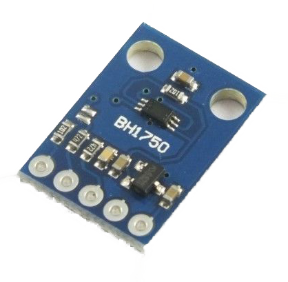

# BH1750 Light Intensity Sensor

Code for getting started with a BH1750 light intensity (lux) sensor.

The BH1750 is a digital light intensity sensor. Light levels are converted and output as a 16-bit lux value.

The sensor uses the I2C bus. The default address for the sensor is 0x23, which can be changed to 0x5C by pulling an ADDR pin high.

 

## Boards

Setup instructions and starter code for different development boards

| Board | Folder |
| --- | --- |
| Arduino Uno | [arduino-uno/](arduino-uno/) |
| Arduino MKR WiFi 1010 | For MKR WiFi 1010 follow instructions for Arduino Uno [arduino-uno/](arduino-uno/) |
| Arduino Nano 33 BLE | For Nano 33 BLE follow instructions for Arduino Uno [arduino-uno/](arduino-uno/) |
| ESP32 | For ESP32 boards, follow instructions for ESP8266 [esp8266/](esp8266/) |
| ESP8266 | [esp8266/](esp8266/) |
| Jetson Nano | For Jetson Nano, follow instructions for Raspberry Pi [raspberry-pi/](raspberry-pi/) |
| Raspberry Pi | [raspberry-pi/](raspberry-pi/) |
|  |  |

 

## Other Files and Folders

| File/Folder | Description |
|--- | --- |
| additional-libraries | Folder contains libraries needed for Arduino sketches. They are included as submodules. Use either `git clone --recursive` or `git submodule init` after cloning. |
| [docs/bh1750fvi-e-186247.pdf](docs/bh1750fvi-e-186247.pdf) | Data sheet for sensor |
|  |  |

 

## Branches

**main**: main branch. currently not using other branches.

 

## References
