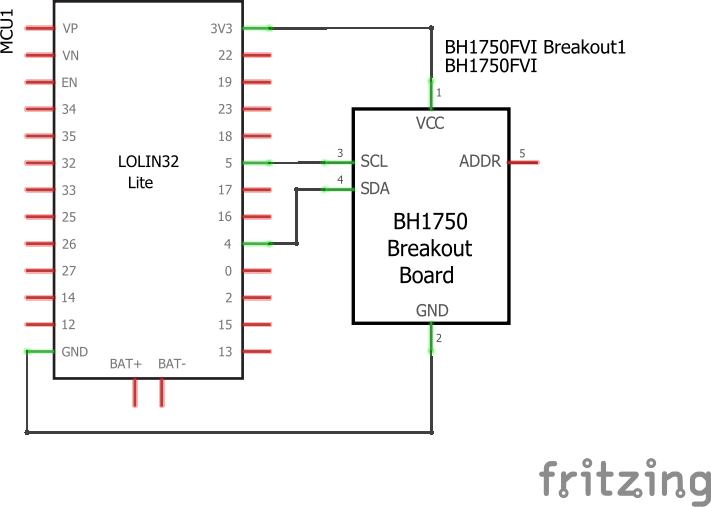
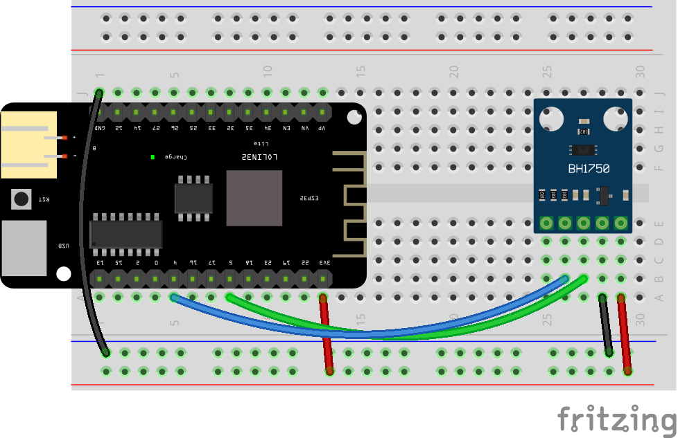
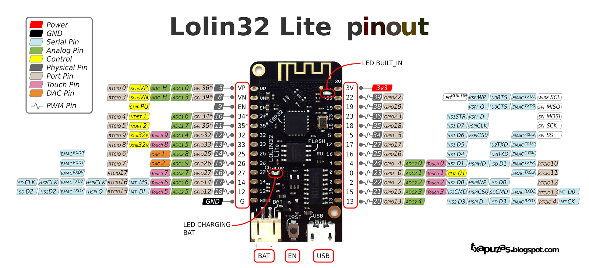

# Setup for ESP32 dev board

Setup instructions for an ESP32 based development board, like the Lolin D32 or Lolin32 Lite.

## Circuit Diagram
Wire the components as shown in the diagram.

#### Components Needed

* BH1750 sensor
* connecting wires
* esp32 development board

 

 

### Default Pin Wiring

| Pin No | Function | Device Connection |
| --- | --- | --- |
|  |  |  |
|  | +3.3V | Vdd |
|  | GND | GND |
| 4 | GPIO4 |  | SDA |
| 5 | GPIO5 |  | SCL |
|  |  |  |

Further details and other board pin out diagrams can be found here: https://randomnerdtutorials.com/esp32-pinout-reference-gpios/

 

## Arduino

The sketch will work with many different types and chipset of board. To use an ESP32 board with Arduino, you will need to install the relevant board configuration files. Follow the instructions here: https://github.com/espressif/arduino-esp32/blob/master/docs/arduino-ide/boards_manager.md

The arduino sketches require the BH1750 library. It is included in the root additional-libraries folder. Afternatively, it can be downloaded through the Arduino libraries manager or from https://github.com/claws/BH1750.

 

## MicroPython

The MicroPython script uses a module from https://github.com/PinkInk/upylib/tree/master/bh1750. It is included in the [micropython/lib](micropython/lib) folder.

 

## References

- https://randomnerdtutorials.com/esp32-pinout-reference-gpios/
