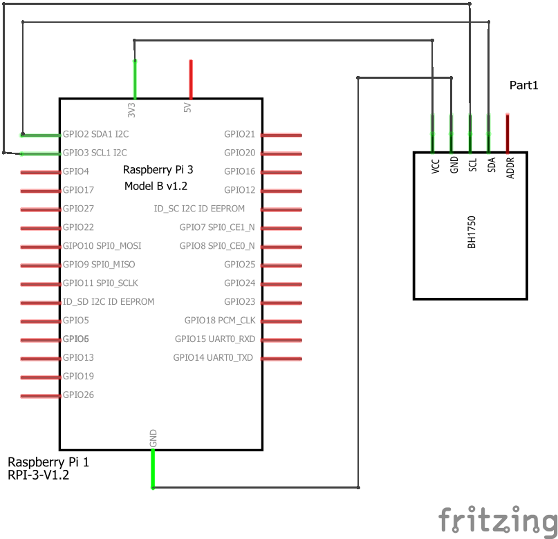

# Raspberry Pi and BH1750 Light Intensity Sensor

 

Code for getting started with a BH1750 light insensity sensor and a Raspberry Pi.

<br />

## Files and Folders

| File/Folder | Description |
|--- | --- |
| [python/](python/) | folder for python scripts. |
| [python/bh1750/](python/bh1750/) | Python module for sensor |
| [python/BH1750DirectReadings.py](python/BH1750DirectReadings.py) | Python script that reads data directly from sensor. |
| [python/BH1750Simple.py](python/BH1750Simple.py) | Python script that reads data from sensor using a module. |
| [config.sh](config.sh) | Bash script to automatically configure and setup the Raspberry Pi for using the ... sensor. |
|  |  |

<br />

## Circuit Diagram

Wire the components as shown in the diagram.



#### Components Needed

* bh1750 breakout board
* connecting wires
* raspberry pi

<br />


<br />

### Default Pin Wiring

| Pin No | Function |  | Device Connection |
| --- | --- | --- | --- |
|  |  |  |  |
| 1 | +3.3V |  | Vdd |
| 3 | GPIO 2 / SDA |  | SDA |
| 5 | GPIO 3 / SCL |  | SCL |
| 6 | GND |  | GND |


<br />

## Configure Raspberry Pi

The Raspberry Pi needs to have the I2C interface enabled and dependancy libraries need to be installed. Either follow the instructions below or run the config.sh script to automatically setup the Raspberry Pi.

```bash
chmod +x config.sh
./config.sh
```

### Enable I2C interface

I2C needs to be enabled on the Raspberry Pi in order to read data from the sensor.

Open the raspi-config tool, found in preferences, or type the following in a terminal.

```bash
sudo raspi-config
```

Under interfaces, enable I2C interface. Click ok and reboot.

Check that the device is communicating properly. In a terminal, type `sudo i2cdetect -y 1`.

```bash
pi@raspberrypi:~ $ sudo i2cdetect -y 1
     0  1  2  3  4  5  6  7  8  9  a  b  c  d  e  f
00:          -- -- -- -- -- -- -- -- -- -- -- -- --
10: -- -- -- -- -- -- -- -- -- -- -- -- -- -- -- --
20: -- -- -- 23 -- -- -- -- -- -- -- -- -- -- -- --
30: -- -- -- -- -- -- -- -- -- -- -- -- -- -- -- --
40: -- -- -- -- -- -- -- -- -- -- -- -- -- -- -- --
50: -- -- -- -- -- -- -- -- -- -- -- -- -- -- -- --
60: -- -- -- -- -- -- -- -- -- -- -- -- -- -- -- --
70: -- -- -- -- -- -- -- --
```

The default address for the sensor is 0x23. The other address is 0x5C using the address pin.

### Python Dependancies

No additional python dependancies needed.

## References

- https://www.raspberrypi-spy.co.uk/2015/03/bh1750fvi-i2c-digital-light-intensity-sensor/
- http://www.pibits.net/code/raspberry-pi-bh1750-light-sensor.php
- https://gist.github.com/oskar456/95c66d564c58361ecf9f
